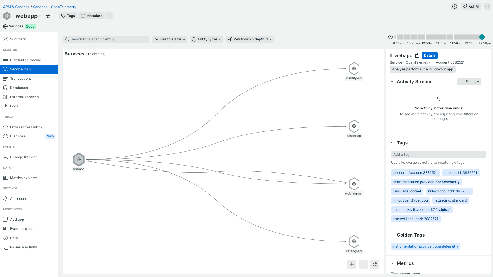
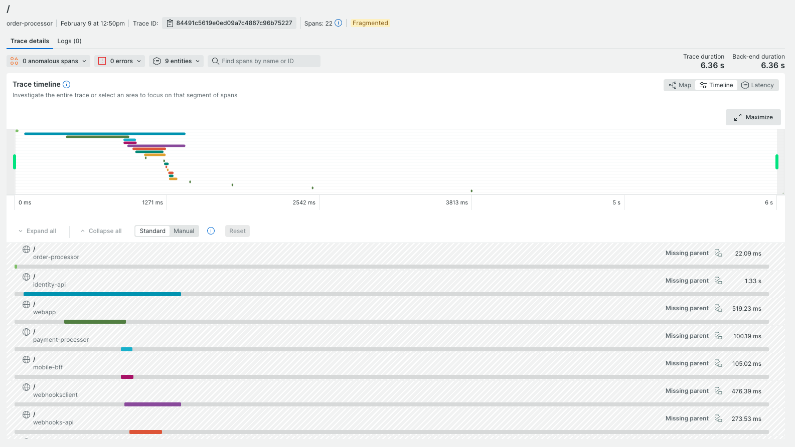

# eShop Reference Application - "AdventureWorks"

A reference .NET application implementing an e-commerce website using a services-based architecture using [.NET Aspire](https://learn.microsoft.com/dotnet/aspire/).


## Getting Started

This version of eShop is based on .NET 9. 

Previous eShop versions:
* [.NET 8](https://github.com/dotnet/eShop/tree/release/8.0)

### Prerequisites

- Clone the eShop repository: https://github.com/dotnet/eshop
- [Install & start Docker Desktop](https://docs.docker.com/engine/install/)

#### Windows with Visual Studio
- Install [Visual Studio 2022 version 17.10 or newer](https://visualstudio.microsoft.com/vs/).
  - Select the following workloads:
    - `ASP.NET and web development` workload.
    - `.NET Aspire SDK` component in `Individual components`.
    - Optional: `.NET Multi-platform App UI development` to run client apps

Or

- Run the following commands in a Powershell & Terminal running as `Administrator` to automatically configure your environment with the required tools to build and run this application. (Note: A restart is required and included in the script below.)

```powershell
install-Module -Name Microsoft.WinGet.Configuration -AllowPrerelease -AcceptLicense -Force
$env:Path = [System.Environment]::GetEnvironmentVariable("Path","Machine") + ";" + [System.Environment]::GetEnvironmentVariable("Path","User")
get-WinGetConfiguration -file .\.configurations\vside.dsc.yaml | Invoke-WinGetConfiguration -AcceptConfigurationAgreements
```

Or

- From Dev Home go to `Machine Configuration -> Clone repositories`. Enter the URL for this repository. In the confirmation screen look for the section `Configuration File Detected` and click `Run File`.

#### Mac, Linux, & Windows without Visual Studio
- Install the latest [.NET 9 SDK](https://dot.net/download?cid=eshop)

Or

- Run the following commands in a Powershell & Terminal running as `Administrator` to automatically configuration your environment with the required tools to build and run this application. (Note: A restart is required after running the script below.)

##### Install Visual Studio Code and related extensions
```powershell
install-Module -Name Microsoft.WinGet.Configuration -AllowPrerelease -AcceptLicense  -Force
$env:Path = [System.Environment]::GetEnvironmentVariable("Path","Machine") + ";" + [System.Environment]::GetEnvironmentVariable("Path","User")
get-WinGetConfiguration -file .\.configurations\vscode.dsc.yaml | Invoke-WinGetConfiguration -AcceptConfigurationAgreements
```

> Note: These commands may require `sudo`

- Optional: Install [Visual Studio Code with C# Dev Kit](https://code.visualstudio.com/docs/csharp/get-started)
- Optional: Install [.NET MAUI Workload](https://learn.microsoft.com/dotnet/maui/get-started/installation?tabs=visual-studio-code)

> Note: When running on Mac with Apple Silicon (M series processor), Rosetta 2 for grpc-tools. 

- Configure your New Relic region and license key
```powershell
export NEW_RELIC_REGION=(US|EU)
export NEW_RELIC_LICENSE_KEY=MY_NEW_RELIC_LICENSE_KEY
```

### Running the solution

> [!WARNING]
> Remember to ensure that Docker is started

* (Windows only) Run the application from Visual Studio:
 - Open the `eShop.Web.slnf` file in Visual Studio
 - Ensure that `eShop.AppHost.csproj` is your startup project
 - Hit Ctrl-F5 to launch Aspire

* Or run the application from your terminal:

```powershell
dotnet run --project src/eShop.AppHost/eShop.AppHost.csproj
```

then look for lines like this in the console output in order to find the URL to open the Aspire dashboard:

```sh
Login to the dashboard at: http://localhost:19888/login?t=uniquelogincodeforyou
```

> You may need to install ASP.NET Core HTTPS development certificates first, and then close all browser tabs. Learn more at https://aka.ms/aspnet/https-trust-dev-cert

### Azure Open AI

When using Azure OpenAI, inside *eShop.AppHost/appsettings.json*, add the following section:

```json
  "ConnectionStrings": {
    "OpenAi": "Endpoint=xxx;Key=xxx;"
  }
```

Replace the values with your own. Then, in the eShop.AppHost *Program.cs*, set this value to **true**

```csharp
bool useOpenAI = false;
```

Here's additional guidance on the [.NET Aspire OpenAI component](https://learn.microsoft.com/dotnet/aspire/azureai/azureai-openai-component?tabs=dotnet-cli). 

### Use Azure Developer CLI

You can use the [Azure Developer CLI](https://aka.ms/azd) to run this project on Azure with only a few commands. Follow the next instructions:

- Install the latest or update to the latest [Azure Developer CLI (azd)](https://aka.ms/azure-dev/install).
- Log in `azd` (if you haven't done it before) to your Azure account:
```sh
azd auth login
```
- Initialize `azd` from the root of the repo.
```sh
azd init
```
- During init:
  - Select `Use code in the current directory`. Azd will automatically detect the .NET Aspire project.
  - Confirm `.NET (Aspire)` and continue.
  - Select which services to expose to the Internet (exposing `webapp` is enough to test the sample).
  - Finalize the initialization by giving a name to your environment.

- Create Azure resources and deploy the sample by running:
```sh
azd up
```
Notes:
  - The operation takes a few minutes the first time it is ever run for an environment.
  - At the end of the process, `azd` will display the `url` for the webapp. Follow that link to test the sample.
  - You can run `azd up` after saving changes to the sample to re-deploy and update the sample.
  - Report any issues to [azure-dev](https://github.com/Azure/azure-dev/issues) repo.
  - [FAQ and troubleshoot](https://learn.microsoft.com/azure/developer/azure-developer-cli/troubleshoot?tabs=Browser) for azd.

## Contributing

For more information on contributing to this repo, read [the contribution documentation](./CONTRIBUTING.md) and [the Code of Conduct](CODE-OF-CONDUCT.md).

### Sample data

The sample catalog data is defined in [catalog.json](https://github.com/dotnet/eShop/blob/main/src/Catalog.API/Setup/catalog.json). Those product names, descriptions, and brand names are fictional and were generated using [GPT-35-Turbo](https://learn.microsoft.com/en-us/azure/ai-services/openai/how-to/chatgpt), and the corresponding [product images](https://github.com/dotnet/eShop/tree/main/src/Catalog.API/Pics) were generated using [DALL·E 3](https://openai.com/dall-e-3).

## eShop on Azure

For a version of this app configured for deployment on Azure, please view [the eShop on Azure](https://github.com/Azure-Samples/eShopOnAzure) repo.

## New Relic observability platform

When sending the telemetry to New relic observability platform, you can nicely observe the entire eShop application.

One way to look at the data is by using New Relic's service map:



... or by visualizing the distributed traces:



## Chaos engineering

eShop ships with built-in synthetic failure modes you can trigger from the URL to drive observable incidents on demand — useful for demoing APM dashboards, alerts, and traces.

Activations are logged with an `Activity` tag `chaos.modes` so they stand out in New Relic / Aspire traces. Modes are off by default; values are tunable via the `Chaos` section in `appsettings.json` for each service.

### How to use

Open the **WebApp** URL (find it in the Aspire dashboard — the `webapp` resource) and append a `chaos` query parameter. The selected modes stick via the `chaos-mode` cookie until you clear them with `?chaos=off`. Multiple modes are comma-separated. A small orange badge in the footer shows which modes are active.

```text
https://<webapp-host>/?chaos=slow,broken-images
https://<webapp-host>/?chaos=off
```

### Frontend modes (WebApp)

- `slow` — injects a 2.5s `Task.Delay` on Catalog, Item, and Cart pages; looks like Blazor server lag.
- `broken-images` — product image URLs point to a 404 path; broken ``s and 404s in the network tab.

### Backend modes (Catalog.API)

The WebApp automatically forwards active chaos modes to Catalog.API via an `X-Chaos-Mode` header, so a single URL on the frontend drives a full-stack incident. You can also hit Catalog.API directly with `?chaos=…` or the `X-Chaos-Mode` header.

- `slow` — `Task.Delay` (default 2.5s) before the endpoint runs.
- `flaky` — probabilistic 500 (default 25%) with problem JSON.
- `memory` — allocates ~50 MB and holds it for the duration of the request; visible as GC pressure.

### Scoping chaos to specific products

By default chaos affects every product, page, and endpoint. To target only specific products, add `chaos-products` (comma-separated product IDs):

```text
https://<webapp-host>/?chaos=slow,broken-images&chaos-products=1,5,9
```

With a product scope set:

- The catalog list and cart pages render normally (they aren't single-product views).
- Only matching `ItemPage` requests slow-render; only matching products show broken images.
- On Catalog.API, only `GET /api/catalog/items/{id}` and `/items/{id}/pic` for matching IDs get chaos; list endpoints are normal.

The product scope is sticky via a `chaos-products` cookie and is forwarded to Catalog.API as `X-Chaos-Products`. Clear it with `?chaos-products=off` (or use `?chaos=off` to clear everything).

### Configuration

Defaults live in each service's `appsettings.json`:

```json
"Chaos": {
  "SlowDelayMs": 2500,
  "FlakyProbability": 0.25,
  "MemoryAllocationMb": 50,
  "DefaultModes": [],
  "Products": []
}
```

Set `DefaultModes` (e.g. `["slow"]`) to keep chaos active without a query parameter, and `Products` (e.g. `[1, 5, 9]`) to scope it to specific items — useful for staging demos.

### Load generator

A Playwright-based load generator drives demo traffic through real Chromium browsers, so the WebApp's Blazor SignalR connections, the New Relic browser agent, and the auth flow all exercise like a real user. Use it together with chaos to drive observable incidents in APM.

The generator assumes Aspire is already running (it does **not** start it). Find the WebApp URL in the Aspire dashboard.

```sh
# 1) Start Aspire as usual.
dotnet run --project src/eShop.AppHost/eShop.AppHost.csproj

# 2) (Optional) Seed per-user logged-in storage states — one auth file per user under
#    playwright/.auth/<user>.json. Each loadgen worker picks one by `workerIndex %
#    USERS.length`, so APM traces show distinct `user.id`s. Skip this and the
#    generator runs anonymous and skips /cart.
USERS=alice,bob PASSWORD='Pass123$' npm run loadgen:auth

# 3) Run the load generator (5 virtual users, 5 minutes by default).
npm run loadgen
```

Tunable via env vars:

- `BASE_URL` — defaults to `http://localhost:5045`.
- `WORKERS` — number of parallel virtual users (= browsers). Default `5`.
- `DURATION_S` — total run time per worker in seconds. Default `300`.
- `THINK_MIN_MS` / `THINK_MAX_MS` — random pause between navigations. Defaults `1000` / `5000`.
- `CHAOS=on` — randomly append `?chaos=…` to ~30% of requests, rotating across `slow`, `broken-images`, and `slow,broken-images`.
- `CHAOS_PROBABILITY` — override that 0.3 ratio.
- `PRODUCT_ID_MAX` — upper bound for product IDs visited (default `100`, matching the seed catalog).

Examples:

```sh
# 10 users, 10 minutes, with chaos rotation
WORKERS=10 DURATION_S=600 CHAOS=on npm run loadgen

# Heavy chaos — 70% of requests carry a chaos param
WORKERS=5 CHAOS=on CHAOS_PROBABILITY=0.7 npm run loadgen
```

Each browser session shows up as its own distributed trace in New Relic, with `user.id` and `product.id` already tagged on the spans you care about.

For more user variety in APM, seed more users (any seeded Identity.API account works — `alice` and `bob` are the defaults, both with password `Pass123$`):

```sh
USERS=alice,bob PASSWORD='Pass123$' npm run loadgen:auth
WORKERS=10 npm run loadgen   # workers rotate through alice/bob round-robin
```
